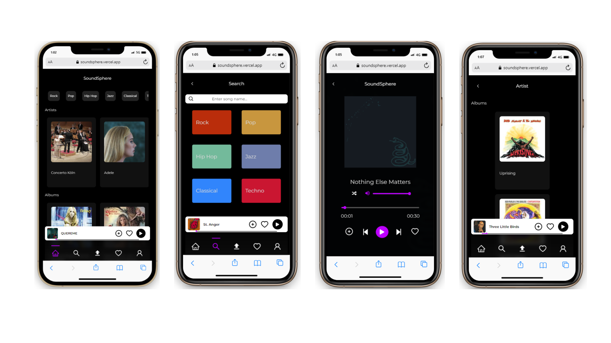

  

# SoundSphere 🎶

SoundSphere emerges as an innovative music player application, skillfully developed using React alongside TypeScript. Boasting a delightful assortment of functionalities, SoundSphere stands as your premier musical ally, offering an immersive experience in the realm of music.

## Introduction

Welcome to the [SoundSphere Backend repository](https://github.com/SoundSphere23/SoundSphereBackend), a crucial component of the SoundSphere music application. The project has been restructured into two separate repositories – one for the backend and another for the frontend. This repository is dedicated to the backend, developed using Node, Express, MongoDB, Prisma and is deployed on [Railway](https://railway.app/) for robust hosting. Additionally, [Cloudinary](https://cloudinary.com/) is integrated for efficient media storage.

## Features

- Powerful backend operations for Create, Read, Update, and Delete (CRUD) on songs.
- Seamless integration with the [frontend](https://github.com/ivanlomoro/SoundSphere) for a cohesive user experience.
- User authentication and authorization through [Auth0](https://auth0.com/).
- This project utilizes MongoDB as its database.
- Hosted on Railway for efficient backend deployment and management.
- Media storage and management through [Cloudinary](https://cloudinary.com/).

## Requirements

- Node.js and pnpm installed.
- Basic knowledge of JavaScript and TypeScript.
- Familiarity with backend development concepts.
- Access to the [SoundSphere Frontend repository](https://github.com/ivanlomoro/SoundSphere).

## Installation and Setup

1. Clone this repository: `git clone https://github.com/SoundSphere23/SoundSphereBackend`
2. Navigate to the server folder: `cd SoundSphereBackend`
3. Install dependencies: `pnpm install`
4. Configure backend environment variables.
5. Run the development server: `pnpm run dev`

## Usage

Access the MovieHub backend server at http://localhost:your_port.

## Deployment

The MovieHub Backend is hosted on [Railway](https://railway.app/), ensuring a stable and scalable backend infrastructure. Deploy updates by pushing changes to the main branch.

## Technologies and Concepts

- Express.js, TypeScript, and Node.js for backend development.
- MongoDB for the database setup.
- Prisma for ORM and database migration.
- Auth0 for user authentication.
- MVC (Model-View-Controller) design pattern.
- [Railway](https://railway.app/) for efficient backend deployment and management.
- [Cloudinary](https://cloudinary.com/) for media storage and management.

## Preview

<table>
  <tr>
    <td></td>
    <td></td>
  </tr>
</table>